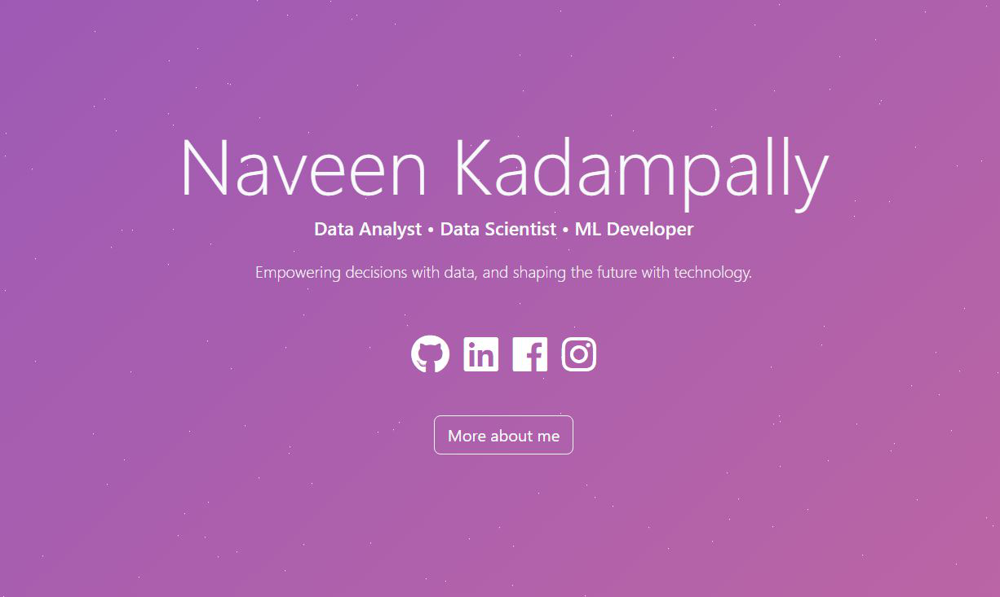

# Naveen Kumar's Portfolio Website

Welcome to the GitHub repository of my personal portfolio website. This repository powers the content available at [nani2357.github.io](https://nani2357.github.io/).

 

## Overview

This portfolio website showcases my work, skills, and experiences as a Data Scientist, Data Analyst, and ML Developer. It serves as a comprehensive platform to get to know more about me, my academic journey, and my professional endeavors.

## Features

- **Home**: Introduction with a dynamic typewriter effect.
- **About Me**: A brief about my academic and professional journey.
- **Skills**: Lists both my hard and soft skills.
- **Experience**: A timeline of my professional experiences.
- **Projects**: Highlights of my notable projects.
- **Certifications**: Certificates I've earned over the years.
- **Contact**: Ways to get in touch with me.

## Technologies Used

- **React**: For building the user interface.
- **Bootstrap**: For design and layout.
- **GitHub Pages**: For deployment and hosting.

## Source Files

The original files for this project can be found in my other repository: [my_portfolio_website](https://github.com/nani2357/my_portfolio_website).

## Acknowledgements

A big thank you to [Hashir Shoaib](https://github.com/hashirshoaeb) for providing the template and complete code for this project. The original files and template can be found at [hashirshoaeb/home](https://github.com/hashirshoaeb/home).

## Contributions

While this is a personal project, I'm open to collaborations and suggestions. Feel free to fork the repository and submit pull requests. If you find any issues or have suggestions for improvements, please submit them using the GitHub issues tab.

## License

This project is open source and available under the [MIT License](LICENSE).
